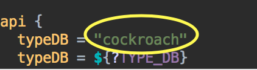
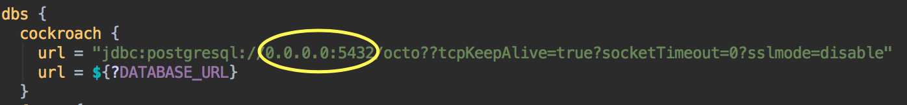
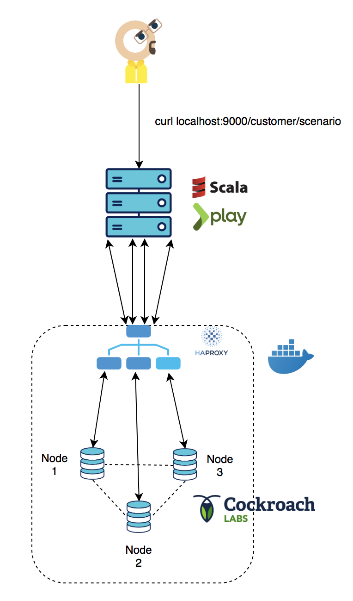

# benchmark-ecommerce-scala
Benchmark Cockroach/Spanner and Fauna in the future, on e-commerce scenarios
The goal of this project it's to bench/test different distributed & transactional databases.
For this moment we only test OLTP transactions, maybe in the future OLAP scenario will be implemented.
This api will simulate client charge on db, like 30k customers with differrent kind of actions 
as : open an order, read product, insert product into basket, validate order...

## Local deployment

### Prerequisites

You will need the following things properly installed on your computer.

#### mac OSX

* [sbt](https://www.scala-sbt.org/1.x/docs/Installing-sbt-on-Mac.html)
`brew update & brew install sbt` 
* [Docker](https://docs.docker.com/docker-for-mac/install/) 
* [docker-compose](https://docs.docker.com/compose/install/) 

#### Linux

* [sbt](https://www.scala-sbt.org/0.13/docs/Installing-sbt-on-Linux.html) 
* [Docker](https://docs.docker.com/install/linux/docker-ce/ubuntu/) 
* [docker-compose](https://docs.docker.com/compose/install/) 


To launch a cockroach Cluster & HAproxy loadbalancer with docker-compose :

```
cd cockroach_Deployment
docker-compose up
```

After this commands lines, we have to configure application.conf.
Set url to 0.0.0.0:5432 haproxy ip and set typeDB to cockroach









### On GCP 
 ---> sooon
## scala api e-commerce scenario logic :

* Start api :
```
sbt run
``` 

* Launch customer scenario benchmark in local : 
```
curl 0.0.0.0:9000/customer/scenario
``` 
more about scenario flow [here](docs/api-scenario-logic.md)

Project architecture 
-

* **app** : contains all the code of the bench
* **conf** : contains configuration db + api and conf about logs

to see more click [here](docs/archi-code.md)


