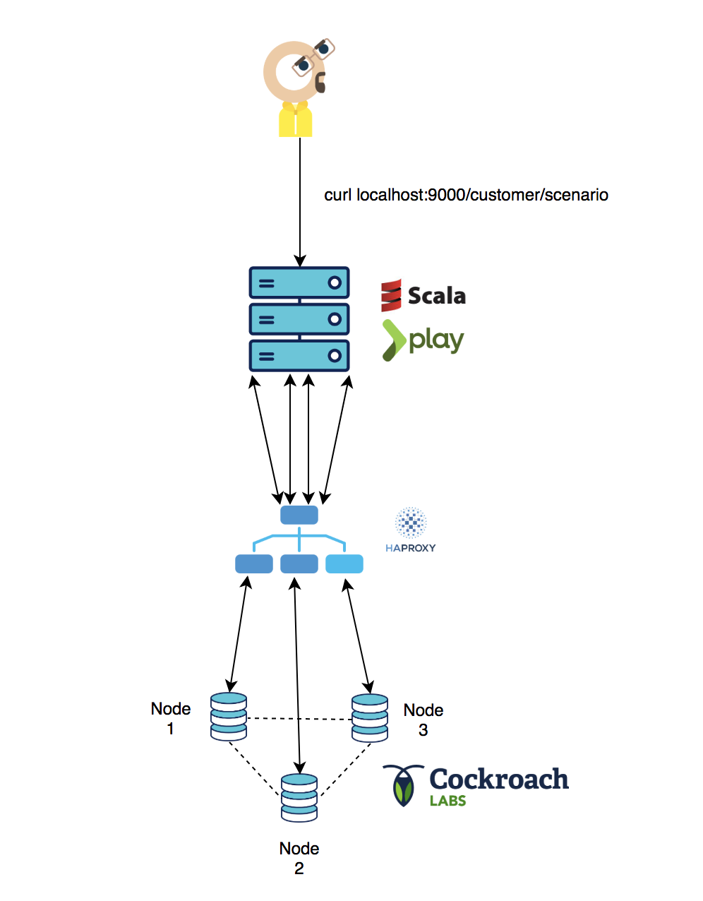

# benchmark-ecommerce-scala
Benchmark Cockroach/Spanner and Fauna in the future, on e-commerce scenarios


## Prerequisites

You will need the following things properly installed on your computer.

##### mac OSX

* [sbt](https://www.scala-sbt.org/1.x/docs/Installing-sbt-on-Mac.html)
`brew update & brew install sbt` 
* [Docker](https://docs.docker.com/docker-for-mac/install/) 
* [docker-compose](https://docs.docker.com/compose/install/) 

##### Linux

* [sbt](https://www.scala-sbt.org/0.13/docs/Installing-sbt-on-Linux.html) 
* [Docker](https://docs.docker.com/install/linux/docker-ce/ubuntu/) 
* [docker-compose](https://docs.docker.com/compose/install/) 

## Cockroach

##### Local 

To launch a cockroach Cluster & HAproxy loadbalancer with docker-compose :

```
cd cockroach_Deployment
docker-compose up
```

After this commands lines, we have to configure application.conf.
Set url to 0.0.0.0:5432 haproxy ip and set typeDB to cockroach


Start api :

```
sbt run
``` 

Launch customer scenario benchmark : 
```
curl 0.0.0.0:9000/customer/scenario
``` 



