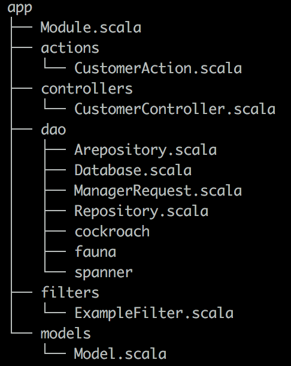

# benchmark-ecommerce-scala
Benchmark Cockroach/Spanner and Fauna in the future, on e-commerce scenarios


## Prerequisites

You will need the following things properly installed on your computer.

### mac OSX

* [sbt](https://www.scala-sbt.org/1.x/docs/Installing-sbt-on-Mac.html)
`brew update & brew install sbt` 
* [Docker](https://docs.docker.com/docker-for-mac/install/) 
* [docker-compose](https://docs.docker.com/compose/install/) 

### Linux

* [sbt](https://www.scala-sbt.org/0.13/docs/Installing-sbt-on-Linux.html) 
* [Docker](https://docs.docker.com/install/linux/docker-ce/ubuntu/) 
* [docker-compose](https://docs.docker.com/compose/install/) 

## Cockroach deployment

### Local 

To launch a cockroach Cluster & HAproxy loadbalancer with docker-compose :

```
cd cockroach_Deployment
docker-compose up
```

After this commands lines, we have to configure application.conf.
Set url to 0.0.0.0:5432 haproxy ip and set typeDB to cockroach


### On GCP 
 ---> sooon
## scala api e-commerce scenario :

* Start api :
```
sbt run
``` 

* Launch customer scenario benchmark in local : 
```
curl 0.0.0.0:9000/customer/scenario
``` 
* What happens ?
    * Api will load a pool of customers and products from the database
    * It will associate actions to each customer
    * After that it will insert a row into the table : 'bench' to say "OK I'm ready"
    * When we saw this row added, we can change the boolean to true into table bench where id = 'starter'
    * When we change this boolean, the api run it scenario 

* What does this scenario ?
    * Customers arrive asynchronously moreover each customer have a thinking time (random 0 upto 50ms)
    * Each action for a customer are executed synchronously
    * Each actions are sent to a "Manager request" 
    * Manager request is a pool of threads, and each thread will unstack action and execute it
    to the database. this process is synchronous, each threads wait the db's response
    
Project architecture 
-
 
### App directories:


**app** contains everything related to the **scenario** and the **databases** implementations




* actions :
    * contains the definition of the actions a customer can do.
* controllers
    * containing the scenario details and logic. *CustomerController* is equivalent to a main file.
* dao
    * contains all the file related to the database implementation of the *actions* and the *thread pool*.
* models
    * contains the case class definition of all the data model : Customer, Product...
* filters
    * wrap an action (httpRequest) and log the total response time 


### conf structure

**conf** contains every config file needed for the scenario


The conf directory contains several configurations files:

* *application.conf* 
    * all the parameters of the api scenario are here.
* *init-schemas.sql* 
    * sql queries to init cockroach schema. (doesn't work for Spanner)
* *logback.xml* 
    * where to set up and config logs behavior.
* *routes* 
    * defined by PlayAPI, it binds route and function to run when the route is triggered.