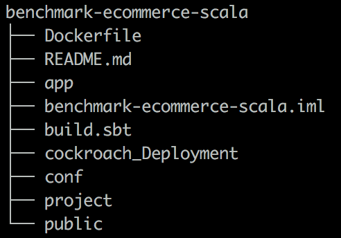

# benchmark-ecommerce-scala
Benchmark Cockroach/Spanner and Fauna in the future, on e-commerce scenarios


## Prerequisites

You will need the following things properly installed on your computer.

### mac OSX

* [sbt](https://www.scala-sbt.org/1.x/docs/Installing-sbt-on-Mac.html)
`brew update & brew install sbt` 
* [Docker](https://docs.docker.com/docker-for-mac/install/) 
* [docker-compose](https://docs.docker.com/compose/install/) 

### Linux

* [sbt](https://www.scala-sbt.org/0.13/docs/Installing-sbt-on-Linux.html) 
* [Docker](https://docs.docker.com/install/linux/docker-ce/ubuntu/) 
* [docker-compose](https://docs.docker.com/compose/install/) 

## Cockroach deployment

### Local 

To launch a cockroach Cluster & HAproxy loadbalancer with docker-compose :

```
cd cockroach_Deployment
docker-compose up
```

After this commands lines, we have to configure application.conf.
Set url to 0.0.0.0:5432 haproxy ip and set typeDB to cockroach


Start api :

```
sbt run
``` 

Launch customer scenario benchmark : 
```
curl 0.0.0.0:9000/customer/scenario
``` 


### On GCP 
 ---> sooon
## scala api e-commerce scenario :

When we call the route customer/scenario, that launch the benchmark. And how works
internally this scenario ?

* Scenario close all connections with the databases and clean the db to have idempotent benchmark
* Scenario load a pool of customers and products
* Scenario insert a record into the db's table "bench" to say I'm ready to start the bench
* We have to change boolean to true in the table bench into the db to say to api : "yes u can start"
* Scenario start to create list actions for a customer (async for each customers)
* Scenario run each actions and send it to "manager_request". It's a pool of threads, threads will
unstack actions list, and send the action to the db selected
 
## Project Architecture


The most useful and important directories are:

* app
* conf

**app** contains everything related to the **scenario** and the **databases** implementations

**conf** contains every config file needed for the scenario

### app architecture


There are several important directories:

* actions
* controllers
* dao
* models
* filters


**actions** directory contains the definition of the actions a customer can do.

**controllers** directory is the directory containing the scenario details and logic. *CustomerController* is equivalent to a main file.

**dao** directory contains all the file related to the database implementation of the *actions* and the *thread pool*.

**models** directory contains the case class definition of all the data model.

**filters** directory is mandatory (otherwise the application fails to run). It is useful for database request delay measurement.

### conf structure


The conf directory contains several configurations files:

* *application.conf* -> all the parameters of the api scenario are here.
* *init-schemas.sql* -> sql queries to init cockroach schema. (doesn't work for Spanner)
* *logback.xml* -> where to set up and config logs behavior.
* *routes* -> defined by PlayAPI, it binds route and function to run when the route is triggered.