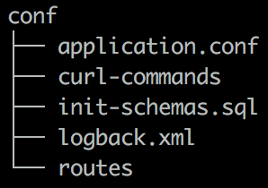

Project architecture 
-
 
### App directories:

**app** contains everything related to the **scenario** and the **databases** implementations

* actions :
    * contains the definition of the actions a customer can do.
* controllers
    * containing the scenario details and logic. *CustomerController* is equivalent to a main file.
* dao
    * contains all the file related to the database implementation of the *actions* and the *thread pool*.
* models
    * contains the case class definition of all the data model : Customer, Product...
* filters
    * wrap an action (httpRequest) and log the total response time 

### conf structure

**conf** contains every config file needed for the scenario

The conf directory contains several configurations files:

* *application.conf* 
    * all the parameters of the api scenario are here. See more here [here](database-application-configuration.md)
* *logback.xml* 
    * where to set up and config logs behavior. See more [here](https://www.playframework.com/documentation/2.6.x/SettingsLogger)
* *routes* 
    * defined by PlayAPI, it binds route and function to run when the route is triggered.